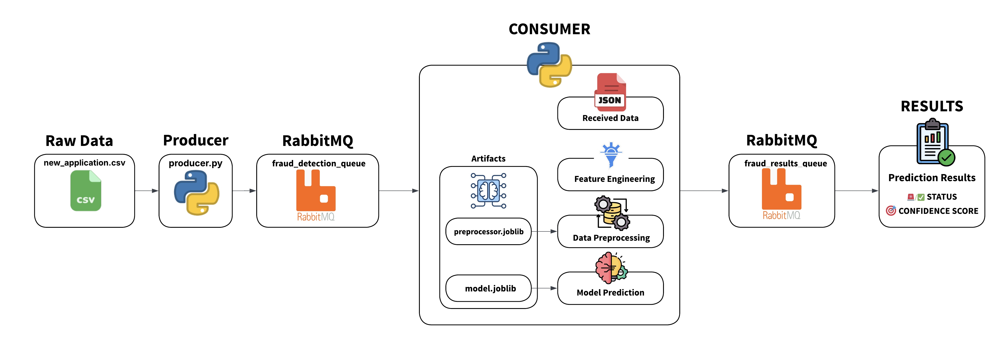

# 🔍 Real-Time Fraud Detection System

A production-ready fraud detection pipeline using RabbitMQ, machine learning, and real-time processing. This system processes transaction data through a trained ML model to detect fraudulent activities in real-time.

## 📋 Table of Contents

- [Files Structure](#-files-structure)
- [System Architecture](#-system-architecture)
- [Prerequisites](#-prerequisites)
- [Installation](#-installation)
- [Running the System](#-running-the-system)
- [Data Flow](#-data-flow)
- [Model Information](#-model-information)
- [Testing with Real Fraud Cases](#-testing-with-real-fraud-cases)
- [Monitoring](#-monitoring)
- [Troubleshooting](#-troubleshooting)

## 📁 Files Structure

```
FraudDetection/
├── src/
│   ├── producer.py           # Transaction data ingestion
│   ├── consumer.py           # ML processing engine
│   └── results_viewer.py     # Real-time results display
├── artifacts/
│   ├── model.joblib          # Trained ML model
│   └── preprocessor.joblib   # Data preprocessing pipeline
├── submissions/
│   └──  *.csv                 # Model predictions
├── image/
│   └── system_architecture.png
├── new_applications.csv      # Sample transaction data
├── requirements.txt          # Python dependencies
├── docker-compose.yml        # RabbitMQ infrastructure
└── README.md
```

## System Architecture

The system is divided into 2 main phases: an offline Training Phase and an online Prediction Phase



### Training Phase

1. **Data Loading & Merging**: Loads raw data from multiple CSV files (`train_transaction.csv`, `train_identity.csv`)
2. **Feature Engineering**: Performs extensive feature engineering, including creating time-based features (Day, TransactionHours, DayofWeek), amount transformations (dollars, cents, log), email domain mapping, device categorization, and V-column selection. Feature selection parameters and domain mappings are calculated and saved.
3. **Data Splitting**: Data is split using GroupKFold and temporal validation to prevent data leakage and mimic realistic fraud detection scenarios.
4. **Preprocessing**: A preprocessing pipeline is defined to handle numerical features, categorical encoding, and feature scaling for the selected V-columns and engineered features.
5. **Model Training**: A XGBoost Model is trained on the preprocessed fraud detection data with class balancing to handle the imbalanced nature of fraud cases.
6. **Artifact Saving**: The trained preprocessor, model, and feature engineering parameters are saved to disk (`model.joblib` and `preprocessor.joblib` files) for use in the real-time prediction phase.

### Prediction Phase (Deployment Workflow)

### 1. **Data Ingestion (Producer)**

- Reads transaction data from CSV (`new_applications.csv`)
- Converts to JSON messages
- Publishes to `fraud_detection_queue`
- Rate-limited processing (1 tx/second)

### 2. **ML Processing (Consumer)**

```python
# Feature Engineering (139+ features)
├── Time Features: Day, TransactionHours, DayofWeek
├── V-columns: 100+ anonymized features (selected subset)
├── Amount Features: dollars, cents, TransactionAmt_log
├── Identity Features: email domains, device types
└── Unique IDs: card+email combinations

# ML Model: XGBoost/LightGBM (trained on 500K+ transactions)
├── Input: 139 engineered features
├── Output: Fraud probability [0-1]
└── Threshold: 0.5 (configurable)
```

- Consumes from `fraud_detection_queue`
- **Feature Engineering:**
  - Remove V-cols
  - Time-based features (Day, Hour, DayOfWeek)
  - Amount features (dollars, cents, log transform)
  - Email domain mapping
  - Device categorization
  - Unique identifier creation
- **Preprocessing:** Transforms the engineered features using the loaded `preprocessor.joblib`
- **Prediction:** Feeds the preprocessed data into the loaded `model.joblib` to predict the loan default status and probability.
- **Publishing:** Results to `fraud_results_queue`

### 3. **Results Display (Viewer)**

- Consumes from `fraud_results_queue`
- Real-time fraud alerts
- Transaction details and confidence scores

## 📦 Installation

### 1. Clone Repository

```bash
git clone https://github.com/khnguyenn/FraudDetection
cd FraudDetection
```

### 2. Install Python Dependencies

```bash
pip install -r requirements.txt
```

### 3. Start RabbitMQ Infrastructure

```bash
docker run -d --name rabbitmq -p 5672:5672 -p 15672:15672 rabbitmq:3-management
```

### 4. Verify RabbitMQ is Running

```bash
# Check containers
docker ps
```

## 🚀 Running the System

### Quick Start (3 Terminal Setup)

#### Terminal 1: Start Results Viewer

```bash
cd src
python results_viewer.py
```

**Output:** `🎯 Listening for results on 'fraud_results_queue'`

#### Terminal 2: Start ML Consumer

```bash
cd src
python consumer.py
```

**Output:** `🎯 Starting fraud detection consumer...`

#### Terminal 3: Send Transaction Data

```bash
cd src
python producer.py
```

**Output:** `Sent transaction tx_1, tx_2, tx_3...`

### Expected Results Flow

```
RAW DATA (SPLITING INTO 1 ROW) -> Producer → Queue → Consumer(Feature Engineering, Preprocessing, Machine Learning model) → Results Queue → Viewer

tx_1: → Feature Engineering → Model Prediction → 85% fraud → 🚨 FRAUD DETECTED
tx_2: → Feature Engineering → Model Prediction → 12% fraud → ✅ LEGITIMATE
```

### Use Real Fraud Cases

```bash
SAMPLE_DATA_CSV = "../new_applications.csv"
# Change the data file u want in producer.py
```

### Expected Output with Real Fraud

```
============================================================
🔍 FRAUD DETECTION RESULT
============================================================
Transaction ID: tx_6
✅ STATUS: LEGITIMATE TRANSACTION
🎯 Fraud Risk: 0.0%
============================================================

============================================================
🔍 FRAUD DETECTION RESULT
============================================================
Transaction ID: tx_4
🚨 STATUS: FRAUD DETECTED
🎯 Confidence: 92.6%
============================================================
```

### Application Logs

```bash
# Consumer logs
tail -f consumer.log

# Producer logs
tail -f producer.log
```
